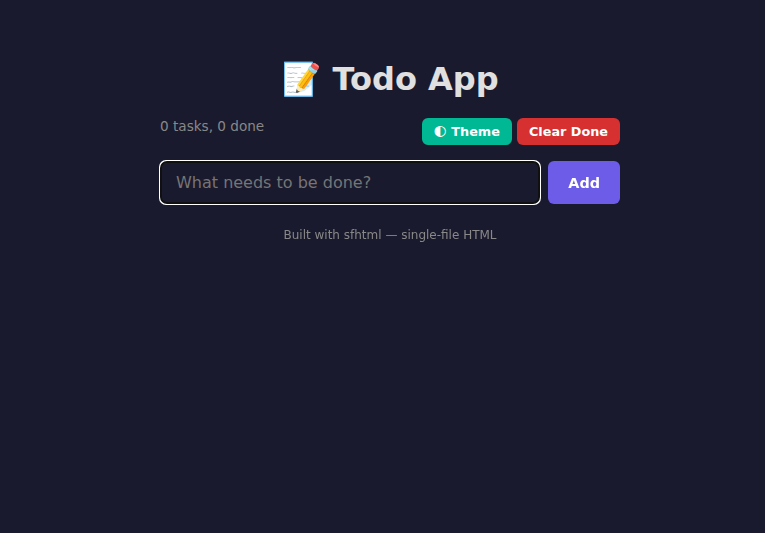
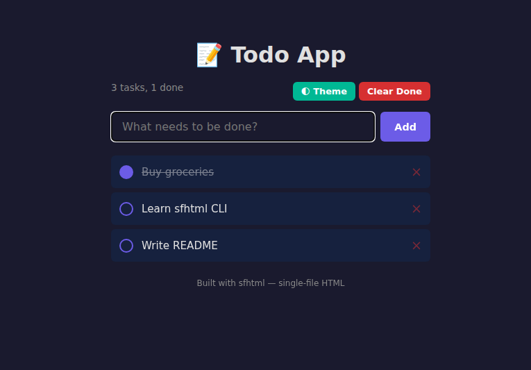

<div align="center">

# sfhtml

**Single-File HTML AI-Skill CLI**

A fast, zero-dependency command-line tool for AI agents to **read**, **edit**, **scan**, **validate**, and **interact** with single-file HTML applications.

[](https://crates.io/crates/sfhtml)
[](LICENSE)
[](https://github.com/anyrust/sfhtml)
[](https://pypi.org/project/sfhtml/)

</div>

---

## Why sfhtml?

Single-file HTML apps (one `.html` file containing HTML + CSS + JS) are the simplest deployable web format. **sfhtml** gives AI agents structured access to these files:

| Capability | What it does |
|:---:|:---|
| 🔍 **Scan** | Discover all HTML files in a workspace |
| 📖 **Read** | Extract headers, read lines, locate anchors |
| ✏️ **Edit** | Apply diffs safely with backup & rollback |
| ✅ **Validate** | Check header↔code consistency + syntax |
| 🌐 **Interact** | Control a headless browser — click, type, screenshot |

---

## Install

### From crates.io (Rust)
```bash
cargo install sfhtml
```

### Python (pip)
```bash
pip install sfhtml
```
> The Python package wraps the Rust binary. If the binary is not on `PATH`, install it first via `cargo install sfhtml` or the quick install script below.

### Quick install script (Linux / macOS)
```bash
curl -fsSL https://raw.githubusercontent.com/anyrust/sfhtml/main/install.sh | sh
```

### From source
```bash
git clone https://github.com/anyrust/sfhtml.git
cd sfhtml && cargo build --release
# Binary at target/release/sfhtml (~2.5 MB)
```

---

## Quick Start

```bash
sfhtml scan ./my-project --recursive    # Find all HTML files
sfhtml header app.html                  # Read structured metadata
sfhtml apply app.html --diff fix.patch  # Apply a code change
sfhtml validate app.html                # Check consistency
sfhtml debug start app.html             # Open in headless browser
sfhtml page screenshot --output s.png   # Take a screenshot
sfhtml debug stop                       # Close browser
```

---

## Walkthrough — Every Command in Action

> All examples below use the [`test/`](test/) directory included in this repo.
> Every output shown is **real** — captured by running sfhtml against the test files.

---

### 1. Workspace Discovery

#### `sfhtml scan` — Find all HTML files

```
$ sfhtml scan test/ --recursive

── HTML files (3 full-scanned) ──
todo.html       →  TodoApp — Minimal task manager
plain.html      →  Plain Page — (feature summary)
dashboard.html  →  Dashboard — Sales analytics dashboard

── Directories (3) ──
  components/ (1 children)
  styles/ (2 children)
  modules/ (3 children)

── Other files (7) ──
  components/button.js
  styles/theme.css
  styles/base.css
  modules/store.js
  modules/utils.js
  modules/chart.js
```

Add `--json` for structured output (recommended for AI agents):

```json
{
  "html_files": [
    {
      "path": "todo.html",
      "app_name": "TodoApp",
      "summary": "Minimal task manager",
      "has_header": true,
      "file_lines": 169
    },
    {
      "path": "dashboard.html",
      "app_name": "Dashboard",
      "summary": "Sales analytics dashboard",
      "has_header": true,
      "file_lines": 171
    }
  ]
}
```

#### `sfhtml search` — Full-text code search

```
$ sfhtml search "DataManager" --dir test/

[
  {
    "path": "dashboard.html",
    "score": 7,
    "matches": [
      { "line": 35, "content": "- `class DataManager` — Fetches, caches...", "type": "header" },
      { "line": 86, "content": "        class DataManager {", "type": "body" },
      { "line": 100, "content": "        const dm = new DataManager();", "type": "body" }
    ]
  }
]
```

---

### 2. Reading & Navigation

#### `sfhtml header` — Extract the AI-SKILL-HEADER

Every sfhtml-aware HTML file contains a structured comment header:

```
$ sfhtml header test/todo.html

# TodoApp — Minimal task manager

## 1. Overview
A lightweight single-file todo application with localStorage persistence,
drag-and-drop reordering, and dark/light theme toggle.

## 2. Public JavaScript API
- window.addTask(text): add a new task, returns task id
- window.removeTask(id): remove task by id
- window.toggleTheme(): switch between dark and light mode
- window.getTasks(): returns array of {id, text, done} objects
- window.clearCompleted(): remove all completed tasks

## 3. Automation Example
await page.goto('file:///path/to/todo.html');
await page.evaluate(() => window.addTask('Buy groceries'));
await page.click('.task-item:first-child .toggle');

## 4. Conventions
- Tasks stored in localStorage key "todo-tasks"
- IDs are timestamp-based integers
- Theme preference saved in localStorage "todo-theme"

## 5. Key Internal Modules
- `<script>`
- `<div id="app">`
- `<ul id="task-list">`
- `<input id="new-task">`
- `<button id="add-btn">`
```

#### `sfhtml read` — Read specific lines

```
$ sfhtml read test/todo.html 81 90

    81│<body class="dark">
    82│    <div id="app">
    83│        <h1>📝 Todo App</h1>
    84│        <div class="toolbar">
    85│            <div class="stats" id="stats">0 tasks</div>
    86│            <div>
    87│                <button class="btn btn-theme" onclick="...">🌓 Theme</button>
    88│                <button class="btn btn-clear" onclick="...">Clear Done</button>
    89│            </div>
    90│        </div>
```

#### `sfhtml locate` — Find code anchors with context

```
$ sfhtml locate test/todo.html "render" --context 3

Anchor "render" found at line 108:
            localStorage.setItem("todo-tasks", JSON.stringify(tasks));
        }

        function render() {
            var list = document.getElementById("task-list");
            list.innerHTML = tasks.map(function(t) {
                return '<li class="task-item" draggable="true" ...' +
```

> Reports every occurrence — not just the first.

#### `sfhtml anchor-list` — List all navigable anchors

```json
$ sfhtml anchor-list test/todo.html --json

[
  { "name": "<script>",             "line": 31, "type": "script-block", "in_header": true },
  { "name": "<div id=\"app\">",     "line": 82, "type": "html-element", "in_header": true },
  { "name": "<ul id=\"task-list\">", "line": 95, "type": "html-element", "in_header": true },
  { "name": "<input id=\"new-task\">","line": 92,"type": "html-element", "in_header": true },
  { "name": "<button id=\"add-btn\">","line": 93,"type": "html-element", "in_header": true }
]
```

#### `sfhtml module` — Scan dependencies

```json
$ sfhtml module test/dashboard.html --json

{
  "file": "test/dashboard.html",
  "total": 1, "local": 1, "remote": 0, "missing": 0,
  "deps": [
    {
      "source": "./styles/base.css",
      "dep_type": "csslink",
      "exists": true,
      "preview": ":root { --bg: #0f172a; --text: #e2e8f0; --accent: #60a5fa; } ..."
    }
  ]
}
```

---

### 3. Editing

#### `sfhtml create` — Create a new file with header

```bash
$ sfhtml create test/new-app.html --with-header --title "NewApp"
Created test/new-app.html (with AI-SKILL-HEADER)
```

#### `sfhtml init` — Inject header into existing file

```bash
$ sfhtml init test/plain.html
AI-SKILL-HEADER injected into test/plain.html
```

Section 5 is auto-generated from code:
```
## 5. Key Internal Modules
- `<script>`
- `<button id="greet-btn">`
- `<div id="output">`
```

#### `sfhtml apply` — Apply a unified diff (with dry-run preview)

Preview first with `--dry-run`:

```
$ sfhtml apply test/todo.html --diff patch.diff --dry-run

Applied 1 hunk to todo.html
  Hunk 1: line 83 → matched at 83 (exact)
  Lines removed: 0, lines added: 1, new size: 7066 bytes

=== Post-Apply Validation ===
✓ Edit success
```

Then apply for real — history is auto-saved:

```
$ sfhtml apply test/todo.html --diff patch.diff

Applied 1 hunk to todo.html
  History saved: 1773588106_308020016_todo.html
  (use `sfhtml history rollback` to undo)
```

#### `sfhtml diff` — Generate diff between two files

```
$ sfhtml diff test/todo.html test/todo-backup.html --context 3

--- a/todo-backup.html
+++ b/todo.html
@@ -83,6 +83,7 @@
         <h1>📝 Todo App</h1>
         <div class="toolbar">
             <div class="stats" id="stats">0 tasks</div>
+            <span class="version">v1.0</span>
             <div>
```

#### `sfhtml save-as` — Copy with header injection

```bash
$ sfhtml save-as test/todo.html test/todo-copy.html --inject-header
Saved test/todo.html → test/todo-copy.html (header injected)
```

---

### 4. Validation & Maintenance

#### `sfhtml validate` — Check header↔code consistency

```
$ sfhtml validate test/todo.html

=== Anchor Consistency ===
✓ 10/10 anchors found in code

=== Syntax Validation ===
✓ Bracket pairs balanced
✓ All id references exist in HTML

→ 0 errors, 0 warnings.
```

If validation fails (e.g. after editing), use `--fix` or rebuild the header:

#### `sfhtml header-rebuild` — Auto-fix Section 5

```bash
$ sfhtml header-rebuild test/todo.html
Header rebuilt successfully.
```

This re-scans the code and regenerates the anchor list in the header.

#### `sfhtml check-output` — Bracket/quote balance check

```json
$ sfhtml check-output test/todo.html

{
  "input_bytes": 7020,
  "input_lines": 169,
  "balanced": true,
  "summary": "0 errors, 1 warning — review before applying"
}
```

---

### 5. History & Rollback

Every `apply` auto-saves a reversible diff. You can inspect and undo any change.

#### `sfhtml history list`

```
$ sfhtml history list

Diff history (4 entries, 135.2 KB / 10240 KB):

  1773588172_... | 2026-03-15 15:22:52 UTC | test/todo.html | +2 -3 (2 hunks)
  1773588106_... | 2026-03-15 15:21:46 UTC | test/todo.html | +2 -1 (1 hunks)
```

#### `sfhtml history show <id>` — View the exact diff

```
$ sfhtml history show 1773588106_308020016_todo.html

--- Forward Diff ---
@@ -83,6 +83,7 @@
+            <span class="version">v1.0</span>

--- Reverse Diff (for rollback) ---
@@ -83,7 +83,6 @@
-            <span class="version">v1.0</span>
```

#### `sfhtml history rollback` — Undo a change

```
$ sfhtml history rollback test/todo.html 1773588106_308020016_todo.html
Rollback applied: 2 hunks, +2 -3 lines. Backup created.
```

---

### 6. Page Interaction — Browser via CDP

sfhtml can launch a headless browser and control the rendered page via Chrome DevTools Protocol.

#### Launch & Screenshot

```bash
$ sfhtml debug start test/todo.html --port 9555
Browser started on port 9555 (pid 376492)

$ sfhtml page screenshot --port 9555 --output docs/images/todo-app.png
{ "saved": "docs/images/todo-app.png", "size_bytes": 18474 }
```

<div align="center">

<br><em>Todo App — initial empty state</em>
</div>

#### Interact — Add tasks, click, evaluate JS

```bash
# Add tasks via the app's public JavaScript API
$ sfhtml page eval 'window.addTask("Buy groceries")' --port 9555
{ "type": "number", "value": 1773588638217 }

$ sfhtml page eval 'window.addTask("Learn sfhtml CLI")' --port 9555
$ sfhtml page eval 'window.addTask("Write README")' --port 9555

# Click the toggle button to mark the first task as completed
$ sfhtml page click ".task-item:first-child .toggle" --port 9555
{ "selector": ".task-item:first-child .toggle", "status": "clicked" }

# Screenshot the result
$ sfhtml page screenshot --port 9555 --output docs/images/todo-tasks.png
{ "saved": "docs/images/todo-tasks.png", "size_bytes": 26907 }
```

<div align="center">

<br><em>Todo App — 3 tasks added, 1 completed — all via sfhtml CLI</em>
</div>

#### Inspect the DOM

```bash
$ sfhtml page dom --selector "#stats" --port 9555
{
  "html": "<div class=\"stats\" id=\"stats\">3 tasks, 1 done</div>",
  "selector": "#stats"
}
```

#### Evaluate JavaScript & Check console

```bash
$ sfhtml page eval 'document.title' --port 9555
{ "type": "string", "value": "TodoApp" }

$ sfhtml page console --port 9555
{ "count": 0, "logs": [] }
```

#### Multiple simultaneous sessions

```bash
$ sfhtml debug start test/todo.html --port 9555
$ sfhtml debug start test/dashboard.html --port 9666

$ sfhtml debug list
  port 9555 | pid 376492 | ws://127.0.0.1:9555/devtools/page/...
  port 9666 | pid 377088 | ws://127.0.0.1:9666/devtools/page/...

$ sfhtml page screenshot --port 9666 --output docs/images/dashboard-app.png
{ "saved": "docs/images/dashboard-app.png", "size_bytes": 56842 }
```

<div align="center">

<br><em>Sales Dashboard — rendered and captured via sfhtml, with Canvas chart &amp; KPI cards</em>
</div>

#### All page commands

| Command | Description |
|---------|-------------|
| `page screenshot` | Capture PNG (`--selector`, `--output`) |
| `page dom` | Get rendered DOM HTML (`--selector`) |
| `page console` | Get console log messages |
| `page network` | Get network request events |
| `page click <sel>` | Click an element by CSS selector |
| `page type <sel> <text>` | Type into an input field |
| `page scroll` | Scroll the page (`--x`, `--y`) |
| `page touch <x> <y>` | Simulate touch event at coordinates |
| `page eval <expr>` | Execute arbitrary JavaScript |
| `page pdf` | Export page as PDF |

#### Stop sessions

```bash
$ sfhtml debug stop --port 9555
Stopped session on port 9555

$ sfhtml debug stop --port 9666
Stopped session on port 9666
```

---

## Complete Command Reference

### Workspace Discovery
| Command | Description |
|---------|-------------|
| `scan <dir>` | Fast-scan directory for HTML files (`--recursive`, `--sort-by`, `--match`, `--top`, `--summary`, `--json`) |
| `search <query>` | TF-based search across HTML files (`--dir`, `--top`) |

### File Reading
| Command | Description |
|---------|-------------|
| `header <file>` | Extract the AI-SKILL-HEADER (structured metadata) |
| `read <file> [start] [end]` | Read specific line ranges (`--head`, `--tail`) |
| `locate <file> <anchor>` | Find a code anchor with surrounding context (`--context N`) |
| `anchor-list <file>` | List all navigable anchors (`--json`) |
| `module <file>` | Scan ES module / resource dependencies (`--depth N` for recursive) |

### File Editing
| Command | Description |
|---------|-------------|
| `apply <file> --diff <patch>` | Apply unified diff (with fuzz matching, auto-backup, post-validation) |
| `diff <new> <old>` | Generate unified diff between two files (`--context N`) |
| `create <path>` | Create a new HTML file (`--with-header`, `--title`) |
| `save-as <src> <dest>` | Copy file, optionally inject header (`--inject-header`) |
| `init <file>` | Inject an AI-SKILL-HEADER template into existing file |

### Validation & Maintenance
| Command | Description |
|---------|-------------|
| `validate <file>` | Check header↔code consistency + syntax (`--fix`, `--json`) |
| `header-rebuild <file>` | Auto-rebuild Section 5 from code (`--dry-run`) |
| `check-output [file]` | Check symbol balance — brackets, quotes (`--context js`) |
| `history list` | Show all saved diffs with timestamps/stats |
| `history show <id>` | View forward + reverse diff for a specific change |
| `history rollback <file> <id>` | Undo a change using the saved reverse diff |
| `history delete <id>` | Delete a specific history entry |
| `history clean` | Clear all history entries |

### Page Interaction (Browser via CDP)
| Command | Description |
|---------|-------------|
| `debug start <file>` | Launch headless browser (`--port`, `--no-headless`) |
| `debug stop` | Stop browser session (`--port`) |
| `debug list` | List all active browser sessions |
| `page screenshot` | Capture PNG (`--selector`, `--output`) |
| `page dom` | Get rendered DOM HTML (`--selector`) |
| `page console` | Get console log messages |
| `page network` | Get network request events (`--wait`) |
| `page click <sel>` | Click an element |
| `page type <sel> <text>` | Type into an input |
| `page scroll` | Scroll page (`--x`, `--y`) |
| `page touch <x> <y>` | Simulate touch event |
| `page eval <expr>` | Execute JavaScript expression |
| `page pdf` | Export page as PDF (`--output`) |

### Global Flags
| Flag | Description |
|------|-------------|
| `--json` | Output structured JSON (recommended for AI agents) |
| `--timeout <ms>` | Maximum execution time |
| `--diagnostic` | Machine-readable diagnostic on stderr |
| `--trace` | Step-by-step execution log on stderr |

---

## AI-SKILL-HEADER Format

sfhtml recognizes a structured comment block at the top of HTML files:

```html
<!-- AI-SKILL-HEADER START
# AppName — Short description

## 1. Overview
A brief description of the application...

## 2. Public JavaScript API
- window.doSomething(arg): description of the function

## 3. Automation Example
await page.evaluate(() => window.doSomething('test'));

## 4. Conventions
- Data stored in localStorage key "app-data"

## 5. Key Internal Modules
- `<script type="module">` — App entry: initApp, bindEvents
- `<div id="app">` — Main layout container
- `function initApp` — Bootstrap: loads config, first render
- `class DataManager` — Fetches, caches, and normalizes data

AI-SKILL-HEADER END -->
```

**Section 5** entries are block-level anchors (no line ranges — code is dynamic). The anchor types by priority:

1. **`<script>`** / **`<script type="module">`** — script blocks (most important)
2. **`<div id="...">` / `<section>` / `<nav>`** — significant HTML elements with id
3. **`function name`** / **`class name`** — major functions and classes

Run `sfhtml header-rebuild <file>` to auto-generate Section 5 from code. Run `sfhtml init <file>` to inject a full header template.

---

## Design Principles

| Principle | Details |
|-----------|---------|
| **Single binary** | Zero runtime deps — just copy and run (~2.5 MB) |
| **AI-first** | All commands support `--json` for structured output |
| **Non-destructive** | `--dry-run` and auto-backup on writes, history with rollback |
| **Gracefully optional** | Browser features warn if no Chrome found; core editing always works |
| **Fast** | Parallel scanning with rayon, memory-mapped file reading |

---

## License

MIT — see [LICENSE](LICENSE).
