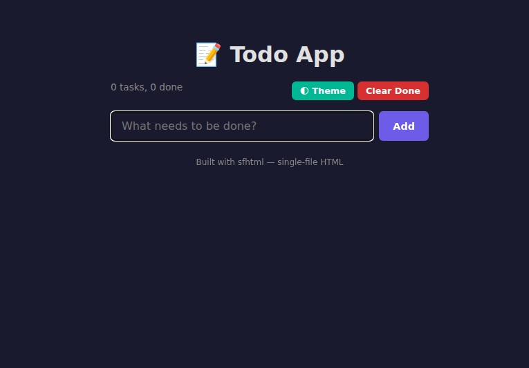
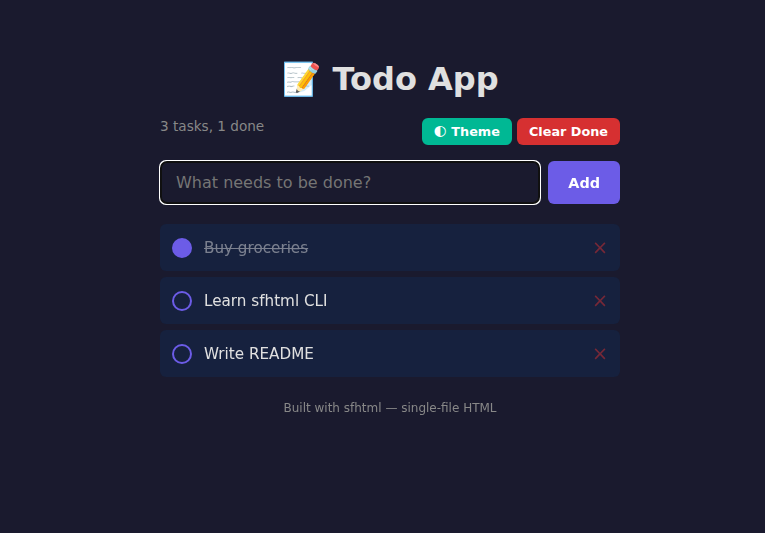
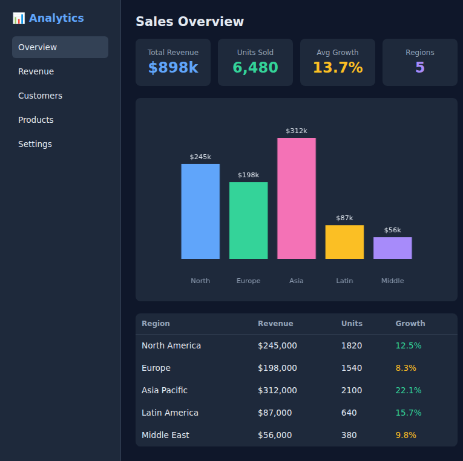

<div align="center">

# sfhtml

**Single-File HTML AI-Skill CLI**

A fast, zero-dependency command-line tool for AI agents to **read**, **edit**, **scan**, **validate**, and **interact** with single-file HTML applications.

[](https://crates.io/crates/sfhtml)
[](LICENSE)
[](https://github.com/anyrust/sfhtml)
[](https://pypi.org/project/sfhtml/)

</div>

---

## Quick Start

```bash
sfhtml scan . --recursive --expand --json   # Discover all HTML files + inline headers
sfhtml locate app.html "initApp" --context 5 # Find code anchor
sfhtml apply app.html --diff fix.patch       # Apply change with auto-backup
sfhtml validate app.html --json              # Verify consistency
```

---

## Install

```bash
# Rust
cargo install sfhtml

# Python
pip install sfhtml

# Linux / macOS
curl -fsSL https://raw.githubusercontent.com/anyrust/sfhtml/main/install.sh | sh

# Windows PowerShell
irm https://raw.githubusercontent.com/anyrust/sfhtml/main/install.ps1 | iex

# AI Skill (VS Code Copilot) — drop SKILL.md into project root
curl -fsSL https://raw.githubusercontent.com/anyrust/sfhtml/main/SKILL.md -o SKILL.md
```

---

## Commands

### Discovery & Metadata
| Command | Description |
|---------|-------------|
| `scan <dir>` | Fast-scan for HTML files (`--recursive`, `--sort-by`, `--match`, `--top`, `--expand`, `--json`) |
| `stat <file>` | File metadata, usage stats, structure summary (`--json`) |
| `search <query>` | TF-based code search (`--dir`, `--top`, `--context`) |

### Read & Navigate
| Command | Description |
|---------|-------------|
| `header <file>` | Extract AI-SKILL-HEADER (`--section N`, `--json`) |
| `read <file> [start] [end]` | Read line ranges (`--head`, `--tail`) |
| `locate <file> <anchor>` | Find code anchor with context (`--context N`) |
| `anchor-list <file>` | List all navigable anchors (`--json`, `--top`) |
| `module <file>` | Scan dependencies (`--depth N`, `--json`) |

### Edit
| Command | Description |
|---------|-------------|
| `apply <file> --diff <patch>` | Apply unified diff (`--dry-run`, `--backup`, `--fuzz`, `--force`, `--json`) |
| `diff <new> <old>` | Generate unified diff (`--context N`) |
| `create <path>` | New HTML file (`--with-header`, `--title`, `--force`) |
| `save-as <src> <dest>` | Copy file (`--inject-header`, `--force`) |
| `init <file>` | Inject AI-SKILL-HEADER into existing file |

### Validate & Maintain
| Command | Description |
|---------|-------------|
| `validate <file>` | Header↔code consistency + syntax (`--fix`, `--json`) |
| `header-rebuild <file>` | Rebuild Section 5 from code (`--dry-run`, `--preserve-descriptions`) |
| `check-output [file]` | Bracket/quote balance (`--mode js\|html\|cli`) |

### History
| Command | Description |
|---------|-------------|
| `history list` | All saved diffs (`--file`, `--top`, `--json`) |
| `history show <id>` | View forward + reverse diff (`--json`) |
| `history rollback <file> <id>` | Undo a change |
| `history delete <id>` | Delete a history entry |
| `history clean` | Clear all history |

### Live Serve
| Command | Description |
|---------|-------------|
| `serve <file>` | HTTP + live reload via WebSocket (`--port`, `--open`, `--live`) |

### Browser (CDP)
| Command | Description |
|---------|-------------|
| `debug start <file>` | Launch headless browser (`--port`, `--no-headless`) |
| `debug stop` | Stop session (`--port`) |
| `debug list` | List active sessions |
| `page screenshot` | Capture PNG (`--selector`, `--output`) |
| `page dom` | Rendered DOM HTML (`--selector`) |
| `page console` | Console log messages |
| `page network` | Network events (`--wait`) |
| `page click <sel>` | Click element |
| `page type <sel> <text>` | Type into input |
| `page scroll` | Scroll (`--x`, `--y`) |
| `page touch <x> <y>` | Touch event |
| `page eval <expr>` | Execute JavaScript |
| `page pdf` | Export PDF (`--output`) |

### Global Flags
| Flag | Description |
|------|-------------|
| `--json` | Structured JSON output (recommended for AI) |
| `--timeout <ms>` | Execution deadline (scan returns partial results) |
| `--head <N>` | First N lines of output |
| `--tail <N>` | Last N lines of output |
| `--grep <pattern>` | Filter lines by pattern |
| `--count` | Print line count instead of content |
| `--truncate <N>` | Truncate to N bytes |
| `--diagnostic` | Machine-readable diagnostic on stderr |
| `--trace` | Execution log on stderr |

---

## Browser Interaction Example

```bash
sfhtml debug start test/todo.html --port 9555
sfhtml page eval 'window.addTask("Buy groceries")' --port 9555
sfhtml page eval 'window.addTask("Learn sfhtml")' --port 9555
sfhtml page eval 'window.addTask("Write README")' --port 9555
sfhtml page click ".task-item:first-child .toggle" --port 9555
sfhtml page screenshot --port 9555 --output docs/images/todo-tasks.png
sfhtml debug stop --port 9555
```

<div align="center">

<br><em>Empty state</em>
<br><br>

<br><em>3 tasks added, 1 completed — all via CLI</em>
<br><br>

<br><em>Dashboard with Canvas chart &amp; KPI cards</em>
</div>

---

## License

MIT — see [LICENSE](LICENSE).
